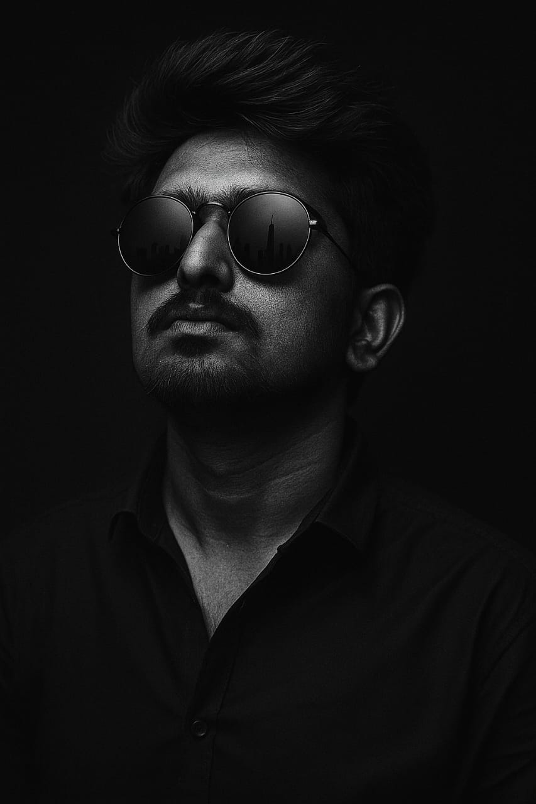

<!DOCTYPE html>
<html lang="en">
<head>
  <meta charset="UTF-8" />
  <meta name="viewport" content="width=device-width, initial-scale=1.0">
  <title>My Portfolio</title>
  
</head>
<body>

  <header>
    <h1>Naveen ND</h1>
    
Web Developer | Designer | Programmer

    
  </header>

  <nav>
    <a href="#about">About</a>
    <a href="#projects">Projects</a>
    <a href="#contact">Contact</a>
  </nav>

  <section id="about" class="about">
    <h2>About Me</h2>
    

      Hi, I’m <strong>Naveen</strong> — a passionate web developer with a strong interest in creating 
      modern, responsive, and user-friendly websites. I enjoy turning complex problems into simple, 
      beautiful, and intuitive solutions.
    

    

      My skill set includes <b>HTML, CSS, JavaScript, and basic frameworks</b>. I also explore 
      creative designs, interactive UI elements, and clean coding practices. Apart from development, 
      I have a keen eye for design which helps me bring ideas to life with both functionality and aesthetics.
    

    

      I’m constantly learning new technologies to improve my work and stay up-to-date with the 
      latest industry trends. I believe in continuous growth, teamwork, and innovation. 
    

    

      Outside of coding, I love exploring new tech tools, building mini-projects like games & apps, 
      and sharing knowledge with friends. 🚀
    

  </section>

  <section id="projects" class="projects">
    <h2>Projects</h2>
    

      

        <h3>Portfolio Website</h3>
        
A responsive personal portfolio built with HTML, CSS, and JavaScript.

      

      

        <h3>Car Game</h3>
        
A fun top-down car racing game coded in JavaScript & Canvas.

      

      

        <h3>AI Chatbot</h3>
        
A simple chatbot powered by natural language processing APIs.

      

    

  </section>

  <section id="contact" class="contact">
    <h2>Contact Me</h2>
    
Email: <a href="mailto:naveendevihosur107@gmail.com">naveendevihosur107@gmail.com</a>

    
Mobile: <a href="tel:+919876543210">+91-8088046932</a>

    

  <a href="https://www.linkedin.com/in/naveen-devihosur-a94728362/?utm_source=share&utm_campaign=share_via&utm_content=profile&utm_medium=android_app" target="_blank" class="btn linkedin">💼 LinkedIn</a>
  <a href="https://github.com/nd-creations" target="_blank" class="btn github">💻 GitHub</a>
  <a href="https://www.instagram.com/naveen_devihosur?igsh=MXJlYTNrYXFnN2Jt" target="_blank" class="btn instagram">📷 Instagram</a>
  <a href="https://wa.me/919876543210" target="_blank" class="btn whatsapp">💬 WhatsApp</a>

    <button onclick="alert('Thanks for reaching out!')">Say Hi 👋</button>
  </section>

  <footer>
    
© 2025 Naveen ND. All Rights Reserved.

  </footer>

</body>
</html> ineed  about me ,projects ,contents different pages
